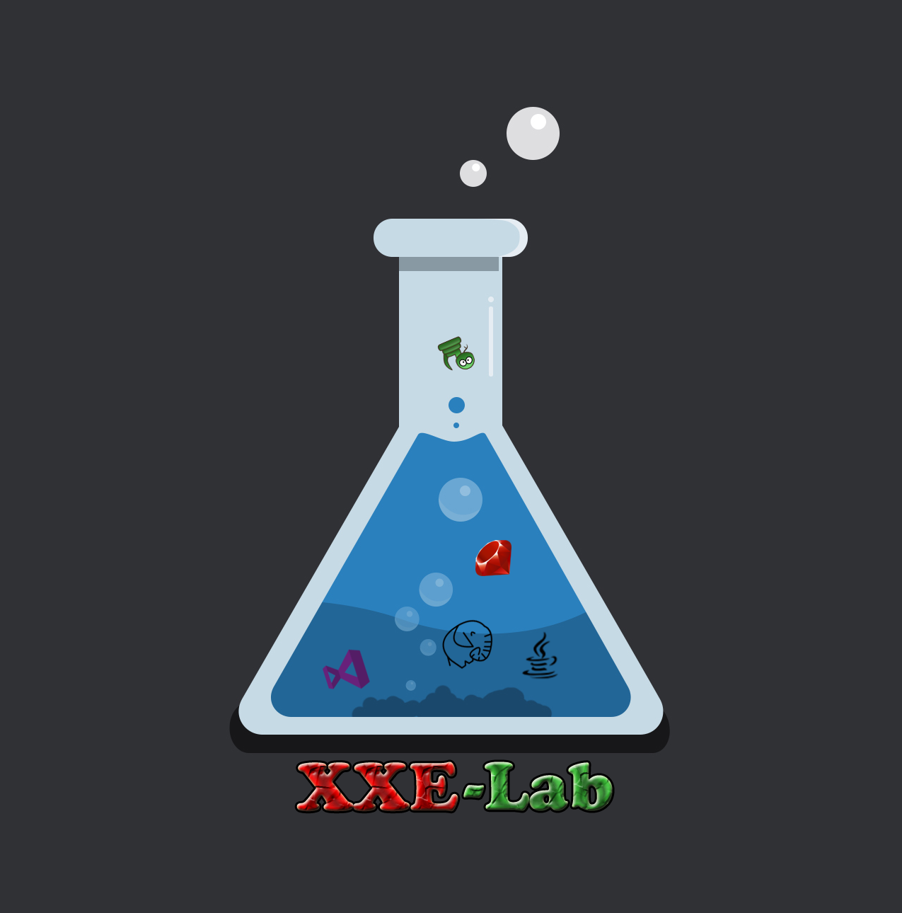
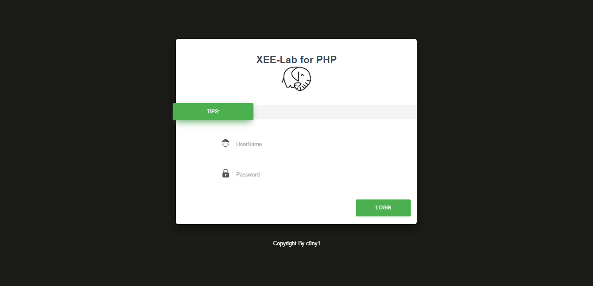
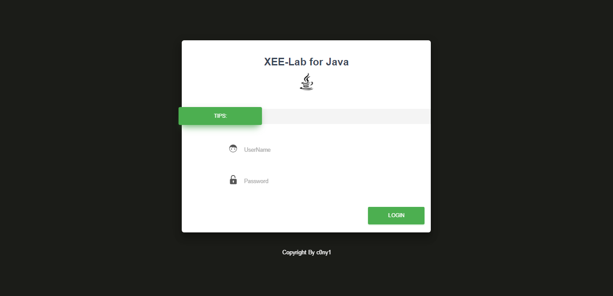
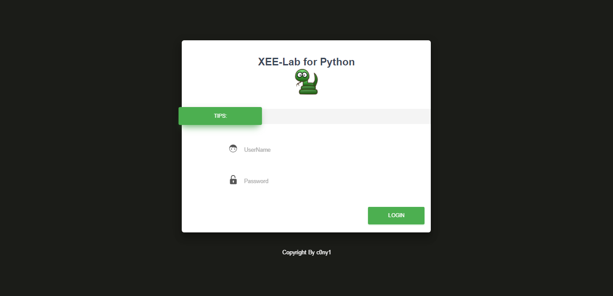
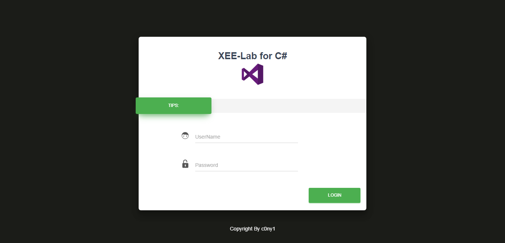
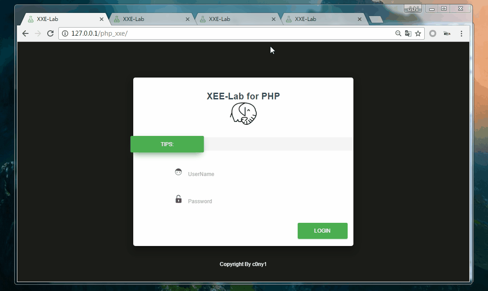

# xxe-lab

xxe-lab是一个使用php,java,python,C#四种当下最常用语言的网站编写语言来编写的一个存在xxe漏洞的web demo。

由于xxe的payload在不同的语言内置的xml解析器中解析效果不一样，为了研究它们的不同。我分别使用当下最常用的四种网站编写语言写了存在xxe漏洞的web dome,为了以后得测试方便，就将这些demoe整合为xxe-lab。代码力求简洁简单，尽量只使用原生库，同时在注释部分包含了修复漏洞的代码。ruby版本有时间再加入！

## 安装
#### 1.php_xxe

直接放在php web页面下即可运行。

#### 2.java_xxe

java_xxe是serlvet项目，直接导入eclipse当中即可部署运行。

#### 3.python_xxe: 

* 安装好Flask模块
* python xxe.py

#### 4.Csharp_xxe 
直接导入VS中运行
## 主界面

## 测试
搭建好环境后就可以对各个语言版本进行测试了。这里以PHP为例子。

